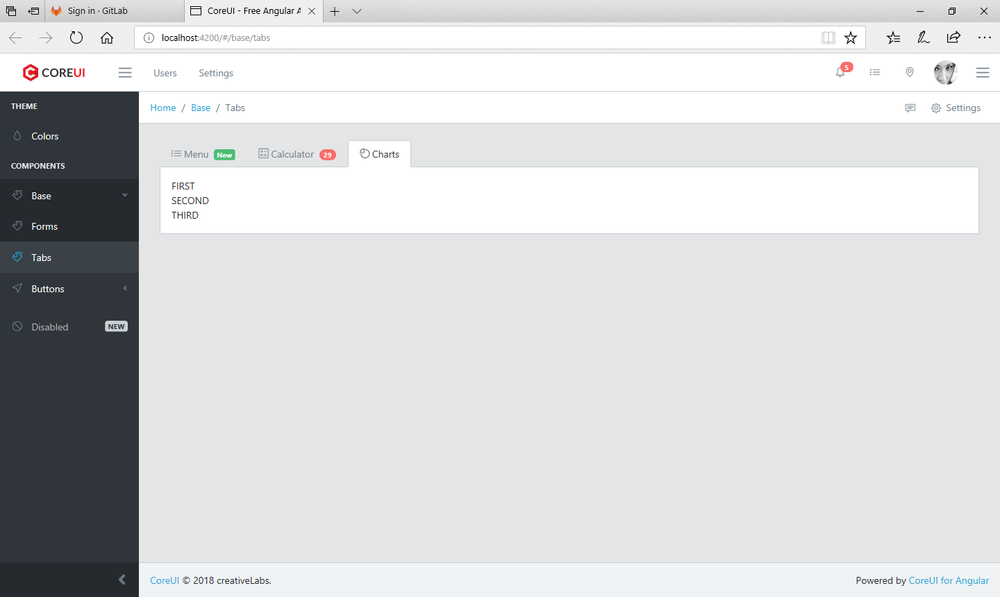

# RESO CALC LOG COMPARE TOOL

### Что в данном коммите:

* Сделал искусственный псевдо-массив на клиенте, который через Обсервер пихает данные массива на страницу;
* Оказалось, что мне нужно не POST-запросом возвращать тестовые премии (ну, то есть по просту, данные), а GET-запросом;
* Реализовал новый метод (и оттестил Постменом) на сервере, который возвращает список тестовых Премий;
* В этом коммите, как и планировал, пропихиваю все ноды и дисты;

### Скриншот:

### Что надо будет сделать в следующем коммите:

* поймать клиентов список тестовых Премий с сервера через HTTP GET;

