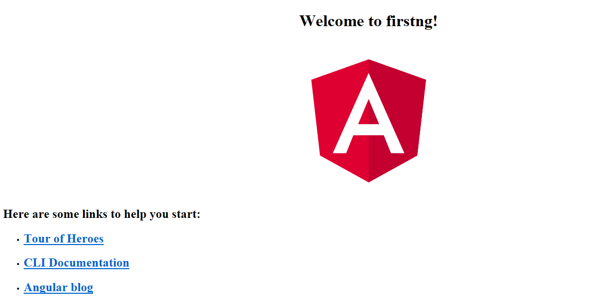

# RESO CALC LOG COMPARE TOOL

### Что в данном коммите:

* Отработан REST в контексте выдачи данных по табличке WsCalcLogNew;
* Возвращаю количество несоответствий на клиента и отображаю во вкладке;
* Переработал форму. Научился дизаблить кнопку, если форма не валидна
* Понял, что нужно отказываться от пагинации, иначе заипемся с выдачей в HTML.
* Выдачу в PDF придется зарубить скорее всего.

### Схема предыдущей версии RCLCT:

Данная схема располагалась в "типа-либе" Reso-Calc-Log-PSHAPOVAL-Library. И класс мейн, а точнее его метод getResult уже дергался из веб-сервиса RCL. Схему данного проекта изложу в следующем коммите.

### Что надо будет сделать в следующем коммите:

* Перенести и отработать на тестовом удаленном сервере; Выложитьи  оставить там;
* Причесать код. Провести все чикины, убрать лишнее, прописать доки и каменты;
* Продумать / почитать / добавить везде юнит-тесты. Тот маленький функционал на сервере, что пока есть, хорошо бы тестануть на все, что можно: нули, слишком большие значения, отрицательные, отсутствующие и прочее;
* Нарисовать нормальную схему и добавить сюда в РИДМИ.

