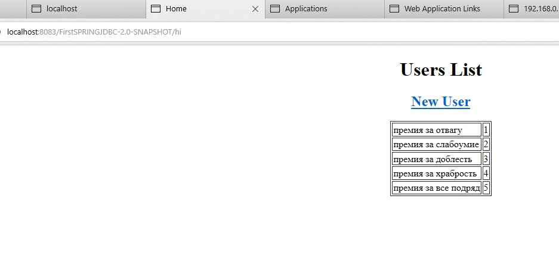

# RESO CALC LOG COMPARE TOOL


### Screenshot


### Что в данном коммите:

* Все! Ништяк! Подключение через Glassfish Connection Pool работает! Ура!

### Косяки:

* Временно пришлось почикать все тесты
* Все еще пока названо по извращенски
* CodeStyle решительно не соблюден, каменты не прописаны
* ConnectionPool пока не тестировал и не прикручивал


### Что надо будет сделать в следующем коммите:

* Почистить код
* Вернуть тесты
* Прописать комментарии
* Немного погонять Style-тесты и тому подобное
* Сделать нормальные имена

### Установка:


```
mvn clean install
```
либо
```
https://192.*.*.*:33246/FirstSPRINGJDBC-2.0-SNAPSHOT/hi
```
, где 192.*.*.*:33246 - адрес тестового сервера GF


