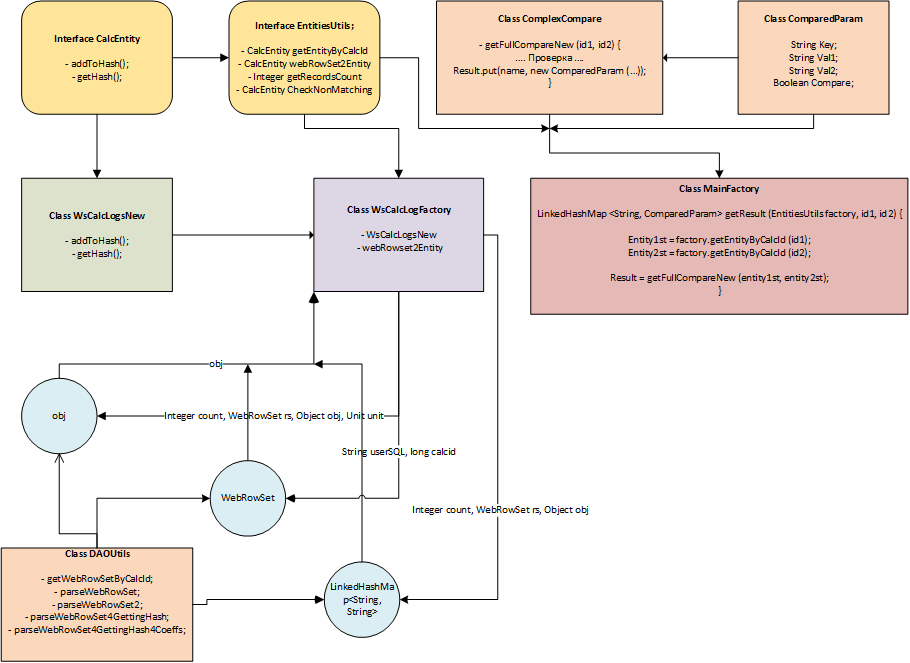

# RESO CALC LOG COMPARE TOOL


### Что в данном коммите:

* Прикрутил Angular

### Почему Angular:

* Во-первых, не нашел нормального хелпа или туториала как спроксировать на нужный порт и base_href Vue-проект.
* Во-вторых, я все-таки начинал JS-фреймворки изучать именно с Angular'а и зашел он мне достаточно быстро. В каком-то роде Java-подобный TypeScript все-таки понятнее замудренного VueJS. Vue при этом заходил крайне тяжело и так и оставил неприятное послевкусие после Angular.
* Angular тупо популярнее. Это полезнее и с точки зрения саморазвития самого разработчика и компании проще найти девелопера потом на такую позицию, так как стек более распространенный.
* В-четвертых, у меня уже были наработки по Angular, который можно было бы использовать.
* В-пятых, по Ангуляру тупо больше туториалов, хелпов, вопросов/ответов на форумах, книг, видео-уроков и так далее.

### Как добавить Ангуляр в проект:

* Ставим Angular. Тут важно отметить, что angular-cli ставит именно 1-й ангуляр, который категорически не совместим с 7-м или 6-м.  Нужно использовать именно ...

```
npm install -g @angular/cli
```
* Понятно, что перед этим должен уже стоять на машине node.js с npm.
* Создаем проект:

```
ng new NameProject // создание проекта
cd NameProject
ng serve --open // запускаем
```
* копируем папку с проектом в папку с проектом REST-сервиса(прямо серверная часть) на java.
* блок serve в angular.json меняем так:

```
"serve": {
          "builder": "@angular-devkit/build-angular:dev-server",
          "options": {
            "browserTarget": "firstng:build",
            "port": 8083
          },
```
* добавляем плагин копирования ресурсов в pom.xml:

```
<plugin>
                <groupId>org.apache.maven.plugins</groupId>
                <artifactId>maven-resources-plugin</artifactId>
                <version>3.0.2</version>
                <executions>
                    <execution>
                        <id>copy-resources</id>
                        <phase>generate-resources</phase>
                        <goals>
                            <goal>copy-resources</goal>
                        </goals>
                        <configuration>
                            <overwrite>true</overwrite>
                            <outputDirectory>${build.directory}/classes/static/</outputDirectory>
                            <resources>
                                <resource>
                                    <directory>${basedir}/firstng/dist/firstng</directory>
                                </resource>
                            </resources>
                        </configuration>
                    </execution>
                </executions>
            </plugin>

```

* билдим проект так, но в будущем это нужно автоматизировать:

```
ng build --base-href /RCCT-2.0-SNAPSHOT/

```

base-href - это путь нашего java приложения на сервере. 

* И в серверной части прописываем где искать статику (ресурсы). AppConfig, если он еще без экстенда - добавляем ему экстенд:

```
public class AppConfig extends WebMvcConfigurerAdapter {
.... some code .....

```

* и добавляем сами ресурсы:

```
@Override
    public void addResourceHandlers(ResourceHandlerRegistry registry){
      //  registry.addResourceHandler("/resources/**").addResourceLocations("classpath:/static/");
        registry.addResourceHandler("/*.js/**").addResourceLocations("classpath:/static/");
        registry.addResourceHandler("/*.css/**").addResourceLocations("classpath:/static/");
        registry.addResourceHandler("/*.html/**").addResourceLocations("classpath:/static/");

    }

```

... то  есть вот это - **"classpath:/static/"** - соответствует тому, что прописали в pom.xml.


### Что надо будет сделать в следующем коммите:

* разобраться с нейменгом модулей (сервиса на джава и как следствие href для angular);
* автоматизировать автоматическую сборку в maven;
* обновить truetype;
* принять решение как пишем фронтенд - используем что-то типа coreUI или собираем из готовых блоков какого-нить "матириала" или "бутстрапа", тыря куски с каких-то сайтов.


### Скриншот:



```


